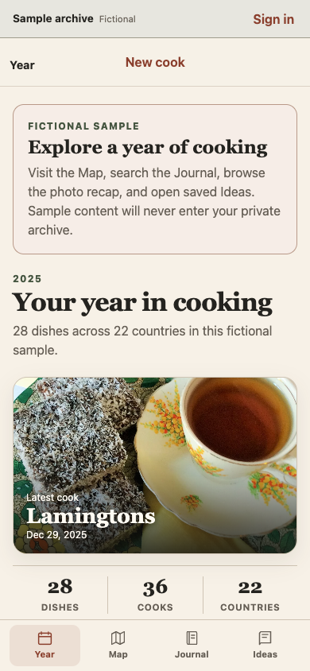
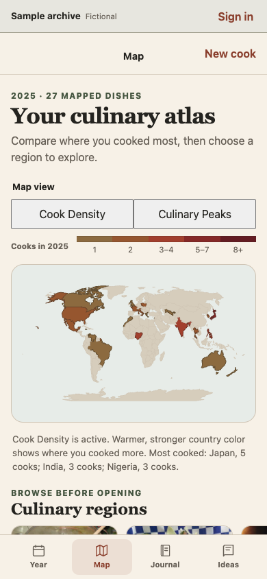
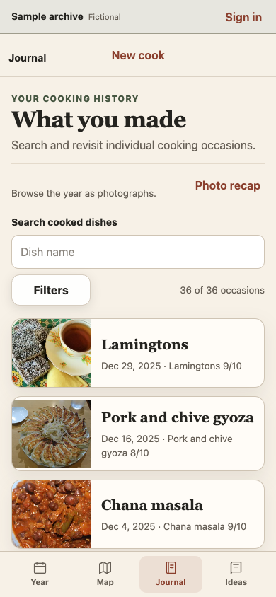
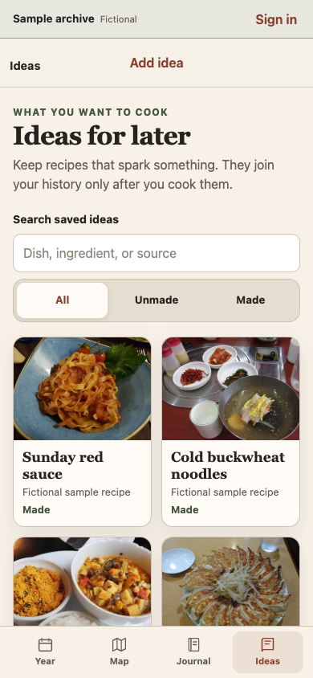
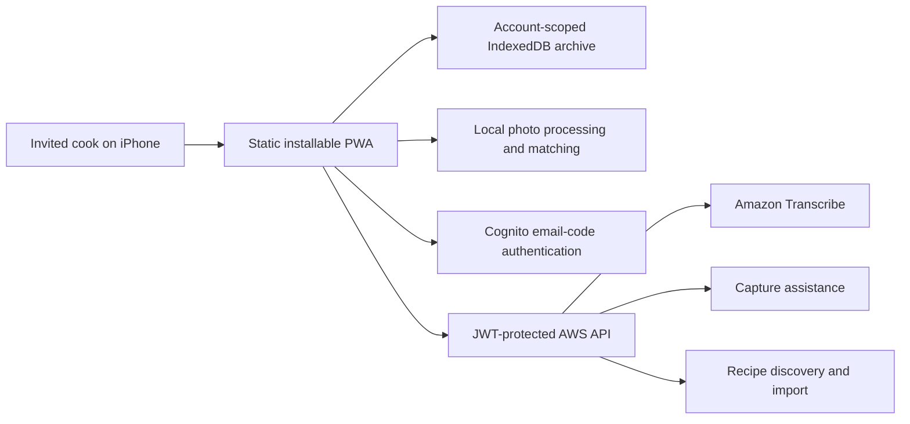

<p align="center">
  
</p>

<h1 align="center">What I Made</h1>

<p align="center">
  A private, photo-first cooking journal that turns everyday meals into a personal history of dishes, discoveries, and progress.
</p>

<p align="center">
  <a href="https://main.dk27yiqjy46kx.amplifyapp.com/?demo=1">Explore the public sample archive</a>
  ·
  <a href="docs/product/PRD.md">Product requirements</a>
  ·
  <a href="ARCHITECTURE.md">Architecture</a>
  ·
  <a href="docs/product/BUILD_NOTES.md">Build notes</a>
</p>

## The challenge

Home-cooked meals disappear quickly. A photograph may survive in a camera roll, but the dish name, rating, ingredients, country, and lessons from that attempt usually do not. Traditional food journals solve the organization problem by adding too much work at the exact moment someone wants to eat.

What I Made began with a simple product question: **How might a frequent home cook preserve the meaning of a meal in seconds, then rediscover that history in ways that feel rewarding?**

## Our approach

The product is designed around the hot-food moment. A cook starts with a photograph and dish name, then can speak naturally instead of completing a long form. Voice assistance cleans the note and proposes editable fields; the person remains the final authority over every saved detail.

The archive becomes more useful over time through three complementary views:

- **Journal:** the chronological record of individual cooking occasions.
- **Year:** a photographic reflection on new dishes, meaningful repeats, and every saved cook.
- **Map:** a geographic view of culinary exploration, with country-density comparison and region-to-dish drill-down.

Privacy shapes the architecture. Authentication controls invitation-only access, while cooks, photographs, recipes, and backups remain in an account-scoped archive on the device. Network services receive only the bounded information required for transcription, capture assistance, or an explicitly requested recipe lookup.

## What it delivers

- Photo-first capture with a minimal photo-and-name path.
- Natural-language voice notes with filler cleanup and editable suggestions for dish, rating, notes, ingredients, and country.
- Multiple dishes and extra photographs within one cooking occasion.
- Trustworthy dish matching, locally learned aliases, international dish recognition, and map-safe country autocomplete.
- Searchable Journal filters for country, year, month, rating, and unrated cooks.
- Canonical dish histories that show every attempt, photograph, rating, and note.
- Calendar-year photo recap grouped by month.
- Culinary map drill-down across 13 regions, countries, and dishes.
- **Cook Density** and **Culinary Peaks** views for comparing where cooking activity is concentrated.
- Recipe **Ideas** imported from a link or discovered from a dish description, saved as editable local snapshots.
- Offline backup, validation, empty-only restore, and archive erasure controls.
- Invitation-only email-code authentication with separate private archives on the same device.
- A public, fictional sample archive that never enters a signed-in user's data.

## Product screens

These screenshots were recaptured from the deployed fictional sample archive on September 15, 2026, at a 390 × 844 iPhone viewport. The sample uses the real browsing interfaces and an isolated, read-only dataset, so anyone can see the product without entering a private archive.

<table>
  <tr>
    <td align="center"><strong>Year</strong><br></td>
    <td align="center"><strong>Map</strong><br></td>
  </tr>
  <tr>
    <td align="center"><strong>Journal</strong><br></td>
    <td align="center"><strong>Ideas</strong><br></td>
  </tr>
</table>

## How the product changed

The shipped product is meaningfully different from the first prototype. The important pivots were driven by device tests and repeated use, not by adding technology for its own sake:

- **Platform choice:** we compared PWA, React Native/Expo, and SwiftUI, then chose an installable PWA only after proving the required iPhone camera, photo-library, local-storage, backup, microphone, and Home Screen behavior.
- **Voice input:** Safari's browser speech-recognition path was not reliable enough on the target iPhone, so the custom voice button moved to Amazon Transcribe while keyboard Dictation remained a fallback.
- **Archive model:** a capture-only, single-dish prototype became a durable journal organized around cooking occasions, because one cook can contain several dishes and photographs.
- **Map:** the early hand-drawn continent shapes were useful as a concept test but not credible geography. They were replaced with public-domain Natural Earth country boundaries, exact country counts, region shelves, and an accessible non-map browsing path.
- **Access:** a fixed owner archive and shared service token gave way to administrator-invited Cognito accounts, email one-time codes, account-scoped local archives, and JWT-protected services.
- **Product tour:** a private-only experience made the product hard to understand before invitation, so we added a fictional public sample that reuses the real read interfaces while remaining isolated from personal data.

## What we learned

- Validate the riskiest device behavior before committing to a platform. The iPhone feasibility work resolved more uncertainty than a longer speculative architecture phase would have.
- Make the core workflow survive without AI. Photo, name, review, save, reopen, edit, backup, and restore remain useful when transcription or model assistance is unavailable.
- AI works best here as an editable proposal. Confidence gates, strict schemas, local country validation, deterministic dish matching, and visible undo matter more than clever prompting alone.
- Local-first storage is a real privacy advantage, but it deliberately trades away automatic cross-device sync. Account identity, cloud service access, archive storage, and backup are separate concerns.
- Maps need trustworthy geography and accessible alternatives. A visually attractive approximation was not enough once the map became a way to inspect real history.
- A public sample needs the same rigor as the private product: fictional records, licensed media, read-only behavior, and a hard boundary preventing sample data from entering an account.

### Development-model experiment

The project was intentionally built in Codex using **GPT-5.6 Sol at medium reasoning** as a consistent constraint. The goal was to explore the limits of one mid-reasoning model across discovery, product design, implementation, debugging, testing, AWS deployment, and documentation instead of switching difficult work to a stronger setting.

It performed well across that range. The larger lesson was that model choice did not replace product judgment or proof: small vertical slices, explicit acceptance criteria, focused automated tests, real-browser checks, physical-iPhone validation, and frequent owner feedback were what kept the work grounded. This development constraint is separate from the models the running application may invoke through AWS Bedrock, which are configured independently by service.

The longer retrospective and decision trail are in [Build notes](docs/product/BUILD_NOTES.md).

## How it works



The browser runs in one of three explicit modes:

- `signedOut` presents the invitation and public sample entry.
- `demo` reads only a bundled, immutable fictional dataset.
- `account` opens the authenticated person's device-local archive.

There is no demo-to-account data path and no default archive fallback. Saved photographs are optimized locally, object URLs are explicitly managed, and backup files exclude authentication state and unfinished recipe drafts.

## Technical highlights

- Accessible, responsive PWA built with semantic HTML, CSS, and modular JavaScript.
- IndexedDB version 5 with atomic occasion, dish, attempt, photograph, Idea, and restore operations.
- Amazon Cognito Authorization Code flow with PKCE and email OTP for administrator-invited users.
- API Gateway JWT authorization in front of bounded AWS Lambda services.
- Amazon Transcribe streaming with an optional culinary vocabulary.
- Deterministic local country resolution and international dish-name correction.
- Strict Content Security Policy, allowlisted deployment packaging, request limits, kill switches, and pseudonymous rate counters.
- Offline shell and archive access through a service worker; cloud-assisted actions fail independently.
- Openly licensed public-demo food photography with source, creator, license, and transformation metadata recorded in the [demo manifest](prototypes/capture-flow/assets/demo/demo-content.json).

## Run locally

From the repository root:

```bash
python3 -m http.server 4173
```

Then open:

```text
http://localhost:4173/prototypes/capture-flow/?voice=fake&assist=fake&recipes=fake
```

The fake adapters exercise capture assistance and recipe flows without calling AWS. Camera and photo-library behavior still use the browser's real file inputs.

## Test

Run the client and device-adapter suite:

```bash
node --test prototypes/capture-flow/tests/*.test.cjs \
  spikes/iphone-feasibility/tests/transcribe-codec.test.cjs \
  spikes/iphone-feasibility/tests/transcribe-adapter.test.cjs \
  spikes/iphone-feasibility/tests/session-handler.test.mjs
```

Run the invitation-access infrastructure tests:

```bash
node --test infrastructure/invitation-access/*.test.mjs
```

Service-specific tests are available through `npm test` in `services/capture-assistance/` and `services/recipe-ideas/`.

## Repository guide

| Path | Purpose |
| --- | --- |
| `prototypes/capture-flow/` | Installable application, local data layer, and client tests |
| `docs/product/` | Product requirements, story map, feature designs, and rollout decisions |
| `design-system/what-i-made/` | Visual, interaction, accessibility, and component guidance |
| `services/capture-assistance/` | Voice-note structuring service |
| `services/recipe-ideas/` | Recipe search, import, generation, and image service |
| `infrastructure/invitation-access/` | Cognito, API Gateway, Lambda, rate limits, and deployment packaging |
| `spikes/iphone-feasibility/` | Device-capability and transcription validation |

## Product boundaries

What I Made is a personal archive, not a social network, recommendation engine, meal planner, or achievement system. It intentionally avoids streaks, public profiles, automatic photo uploads, and silent AI decisions. The current production release is distributed privately by invitation rather than through the App Store.

## Status

The current PWA is deployed on AWS Amplify and has been validated on the owner's iPhone. The public sample is available without authentication; private archive access requires an invited email address. See the [test report](prototypes/capture-flow/TEST_REPORT.md) and [rollout checklist](docs/product/invitation-only-access/ROLLOUT_CHECKLIST.md) for current proof and remaining device-level checks.
