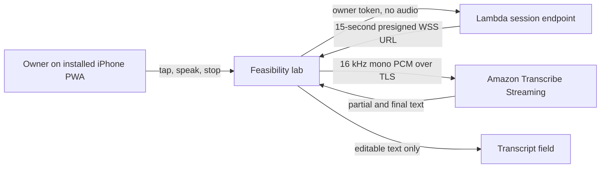

# One-Tap AWS Transcription Spike

> **Status:** Validated on the owner’s iPhone and integrated into the capture prototype

> **Invitation-access addendum, September 8, 2026:** The owner-token and Lambda Function URL boundary below is historical and superseded by [Invitation only private archives](../../product/invitation-only-access/design.md). The current signer accepts only API Gateway-validated Cognito access-token claims through the unified service API; there is no shared-token fallback. The audio-streaming, privacy, and device-feasibility findings remain applicable.

## 1. Executive summary

Safari's browser speech-recognition route accepted microphone access on the owner's iPhone but did not return words. Keyboard Dictation works, but it hides the action behind the keyboard and does not provide the preferred one-tap capture experience. This spike will add a dedicated **Speak your cook** button to the iPhone feasibility lab. The browser will convert microphone samples to short PCM audio chunks and stream them directly to Amazon Transcribe over an encrypted WebSocket. A small protected Lambda function will issue a short-lived connection URL, but it will never receive audio. The main downside is a small AWS backend and a one-time owner-token setup.

## 2. Context and scope

The existing lab has already proved Home Screen installation, camera and library access, photo optimization, and durable local storage on the target iPhone. It separately proved that raw microphone capture works and Safari speech recognition does not. The owner has accepted Amazon Transcribe as the custom-button route and keyboard Dictation as the fallback.

This design covers the smallest end-to-end transcription route: authorization, WebSocket session creation, browser audio conversion, live and final transcript handling, cancellation, privacy text, cost monitoring, test evidence, and teardown. The validated adapter now replaces browser speech recognition in the capture prototype. A local deterministic parser demonstrates editable dish, rating, notes, ingredients, and country suggestions; production-grade classification and durable cooking records remain outside this slice.

## 3. System context



The browser owns microphone permission, transient audio conversion buffers, the active socket, and visible transcript state. Lambda owns owner-token verification and URL signing. Amazon Transcribe owns speech recognition during an active stream. What I Made and Lambda do not durably store audio. AWS documents that Transcribe stores voice input by default for service improvement, so a Transcribe-specific AWS Organizations opt-out policy is required before a real cooking note is sent.

## 4. Proposed design

### How it works

The owner enters a high-entropy setup token once on the device. The token is stored in the lab's existing local IndexedDB boundary and is sent only to the configured Lambda URL. When the owner taps **Speak your cook**, the lab synchronously creates and resumes an `AudioContext` from that user activation, then requests microphone permission. It verifies that the context is running before sending `POST /session` with the token and fixed language and sample-rate values. Lambda compares a SHA-256 hash of that token with the configured owner-token hash using a constant-time comparison. If it matches, Lambda signs an Amazon Transcribe WebSocket URL that expires after 15 seconds and returns it without AWS credentials.

The browser opens the URL, down-samples the microphone's mono float samples to 16 kHz, converts them to signed 16-bit little-endian PCM, wraps 50 to 200 milliseconds of audio in AWS event-stream frames, and sends those frames directly to Transcribe. An `AudioWorklet` is preferred; a short-lived `ScriptProcessorNode` adapter is allowed only as the iPhone compatibility fallback and is isolated behind the same interface. Partial words appear in a separate live preview so they cannot overwrite text the owner types or dictates during the session. When the session ends, the latest final—or, on failure, partial—voice text is appended to the editable transcript. Tapping **Done** sends an empty audio frame, releases every microphone track, closes the audio graph, and waits up to three seconds for the final result before closing the socket. The hard stop runs at 45 seconds. Keyboard Dictation and typing remain visible alternatives.

The transcript remains local after transcription. A later production slice may send it to a separate parsing endpoint only after the owner chooses **Review cook**.

### Components and responsibilities

**Feasibility-lab voice panel.** Owns setup-token entry, the primary button, elapsed time, privacy disclosure, editable transcript, and recovery actions. It does not parse or save a cooking record.

**Browser voice adapter.** Owns the finite states `idle`, `authorizing`, `connecting`, `listening`, `finishing`, `complete`, and `failed`; microphone, track, and `AudioContext` lifecycle; PCM conversion; event-stream framing; transcript assembly; and idempotent cleanup. It does not sign AWS requests or durably retain audio.

**Session Lambda.** Owns exact-origin CORS, token verification, request validation, presigning, privacy-safe logging, and the transcription kill switch. It does not receive microphone bytes, proxy the stream, or store transcripts.

**Lambda execution role.** May call `transcribe:StartStreamTranscriptionWebSocket` and write to this function's CloudWatch log group. It has no S3, database, Bedrock, or account-administration permissions.

**Amazon Transcribe Streaming.** Receives one active PCM stream and returns transcript events. It does not receive photos or the cooking archive. Its documented default service-improvement storage is disabled with an AWS Organizations opt-out policy before device testing.

### Decisions

#### Stream directly from the browser

The spike uses a presigned WebSocket instead of proxying audio through Lambda. This preserves the stated privacy boundary, avoids a long-running WebSocket server, and matches Amazon Transcribe's documented WebSocket protocol. The browser must therefore maintain a small event-stream encoder and PCM converter. An AWS sample demonstrates this browser-to-Transcribe shape, but its practice of accepting AWS keys in the page is rejected.

#### Use a Lambda Function URL with an owner token

A Function URL plus an app-level owner token is the smallest protected session endpoint for one person. The public JavaScript contains the endpoint URL but no token or AWS credential. Only the token hash is configured in Lambda. A Cognito user pool is rejected for this spike because account recovery, hosted sign-in, and refresh-token behavior do not help prove microphone-to-transcript feasibility. The cost is a one-time token entry and manual token rotation if the device or origin is compromised.

#### Keep the stream fixed and short

The spike supports only `en-US`, mono PCM, 16 kHz output, one active session, and a 45-second client limit. Fixed settings shrink the attack surface and the number of iPhone cases to prove. A presigned URL expires after 15 seconds, but expiration does not terminate a socket that has already connected. Client cleanup and the Transcribe service's own idle behavior reduce normal accidental use, but they are not a server-enforced duration or spending guarantee.

#### Extend the feasibility lab before the capture prototype

The lab will prove device behavior and privacy evidence first. It will add a separate result for AWS transcription while keeping the failed Safari result as evidence. Once the real iPhone passes, the same adapter can replace the capture prototype's `SpeechRecognition` implementation. This avoids presenting an unproved service route as finished product behavior.

## 5. Invariants and requirements

### Invariants

- `INV-12`: No photograph, cooking record, or saved archive data is sent by the transcription spike.
- `INV-13`: Microphone audio travels from the browser only to the selected Amazon Transcribe regional endpoint over TLS.
- `INV-14`: What I Made and Lambda do not write microphone audio to logs, IndexedDB, Cache Storage, S3, or another durable store. Transient browser buffers become unreachable during cleanup.
- `INV-15`: The shipped bundle contains neither the owner token nor an AWS access key, secret key, or session credential.
- `INV-16`: A failed or cancelled transcription leaves existing transcript text editable and releases the microphone, audio graph, timers, and socket.
- `INV-17`: A transcript is never treated as a confirmed dish field or saved cooking record by this spike.
- `INV-18`: Only a valid owner token can obtain a signed transcription session.
- `INV-19`: The custom button stops itself after 45 seconds of active capture and typing remains available in every state.
- `INV-20`: Logs contain request ID, outcome, and latency only. They do not contain tokens, signed URLs, audio, or transcript text.

### Requirements

- The primary voice action has a minimum 44-by-44 CSS-pixel target, visible pressed and busy states, and a descriptive accessible name.
- One atomic polite status announces authorization, connection, listening time, finishing, completion, and recoverable errors without moving focus.
- The transcript field remains a normal editable textarea and works with iPhone keyboard Dictation.
- A visible disclosure says audio goes to Amazon Transcribe only while the button is active, is not durably retained by What I Made or Lambda, and may be retained by AWS as needed to provide and maintain the service even after service-improvement use is disabled.
- The Function URL CORS layer answers only required `OPTIONS` preflights and permits only the deployed origin, `POST`, and the `Authorization` and `Content-Type` headers. Lambda rejects application requests other than `POST`, unknown JSON keys, unsupported locales or sample rates, missing tokens, and bodies above 1 KB.
- The lab can disable AWS transcription with a static feature flag or a Lambda environment kill switch while leaving microphone, typing, photos, storage, and Files tests functional.

## 6. Interfaces and data

### Session request

```http
POST /session
Authorization: Bearer <owner-token>
Content-Type: application/json

{"languageCode":"en-US","sampleRateHertz":16000}
```

Successful response:

```json
{
  "websocketUrl": "wss://transcribestreaming.us-east-2.amazonaws.com:8443/...",
  "expiresAt": "2026-09-02T18:20:15.000Z",
  "maxCaptureSeconds": 45,
  "region": "us-east-2"
}
```

The browser treats the signed URL as a short-lived secret and never logs, stores, copies, or includes it in the feasibility report. Errors use `{ "error": "unauthorized|disabled|invalid_request|unavailable" }` and an appropriate HTTP status. Function URL configuration owns CORS headers and the `OPTIONS` preflight; Lambda does not duplicate them. Session responses include `Cache-Control: no-store`.

### Browser adapter

```text
new Adapter({ endpoint, onText, onState, maxCaptureSeconds })
start(token) -> Promise<void>
stop() -> Promise<void>
cancel() -> Promise<void>
```

Only one `start` call may be active. A second call receives `already_active`. `stop` requests final text; `cancel` closes immediately while retaining text already shown.

### Naming and identity

Each session receives a `crypto.randomUUID()` session ID in the signed Transcribe query. It is never a cooking-record ID and is not persisted. A new start always receives a new session ID. Transcript segments use the ordered result events from one socket; partial text is replaceable until the same result becomes final.

### Configuration

The static lab exposes the equivalent `sessionEndpoint`, `region`, `enabled`, and `maxCaptureSeconds` fields through `window.WIM_VOICE_CONFIG`. Lambda has `ALLOWED_ORIGIN`, `OWNER_TOKEN_SHA256`, `VOICE_ENABLED`, and `PRESIGN_EXPIRES_SECONDS`. No plaintext token is configured server-side.

## 7. Failure behavior and lifecycle

Missing configuration disables the custom button and keeps typing available. A missing token opens the setup field rather than asking for microphone permission. A wrong token produces an inline authorization error and no signed URL. A denied microphone request never calls the session endpoint.

If the audio context cannot reach `running`, signing or network setup fails, or the microphone track becomes `muted` or `ended`, the browser releases the microphone and returns to `failed`. Each start has an identity and abort signal; cleanup invalidates that identity, aborts a pending session request or socket connection, and ignores every late callback. The full pre-listening setup has a 15-second deadline and the socket connection has its own eight-second timeout. Audio-context state is checked after every startup await as well as by event, so a `suspended`, `interrupted`, or `closed` context also ends authorization or connection safely. The owner can retry once manually; the app performs no automatic start retry because another prompt or paid session would be surprising. If the WebSocket fails before opening, the same cleanup occurs. If it fails after partial text, that text is appended to the editable field.

Tapping **Done** prevents new audio frames, sends the empty final frame, and waits at most three seconds for a final transcript. It then closes the socket whether or not a final event arrived. Tapping **Cancel**, navigating away, receiving `pagehide`, or reaching 45 seconds closes immediately and releases all resources. Repeated stop and cleanup calls are safe.

If the app is backgrounded, `visibilitychange` stops capture immediately; returning to the app does not restart it. A feature-flag change affects the next session. Disabling the Lambda kill switch rejects new sessions; an already-open direct Transcribe socket runs until client cleanup or service termination.

## 8. Security, privacy, and operations

The deployed Amplify origin and a scoped Cognito access token establish access to the session endpoint. API Gateway validates token audience and capture scope before Lambda invocation; the retired shared owner-token and Function URL path are no longer accepted. CORS limits browser origins but is not authentication. Authorization is checked before input-dependent AWS work, and errors do not reveal token details.

The signer may add the configured, READY `en-US` public culinary vocabulary. If a vocabulary-enhanced socket cannot open, the client requests one new signed session with `useVocabulary: false` and continues without blocking manual capture. Private archive dish names are never uploaded into this vocabulary.

The URL signer uses Lambda's temporary execution-role credentials. The role grants `transcribe:StartStreamTranscriptionWebSocket` on `*`, because that streaming action does not support a narrower resource ARN, plus log-stream creation and writes scoped to this function's CloudWatch log group. The signed URL uses a unique session ID, fixed region, locale, encoding, and sample rate, and a 15-second expiry. Content Security Policy permits connections only to the Lambda origin and `wss://transcribestreaming.us-east-2.amazonaws.com:8443`.

Before the first real note, the AWS account must have an effective Transcribe opt-out policy for service improvement. AWS may still process and retain data needed to provide and maintain the service under its service terms; the interface discloses AWS as the processor. If the account cannot configure the opt-out, the deployed button remains disabled and no real audio is sent.

The endpoint has reserved concurrency one. The client permits one stream and stops at 45 seconds. The AWS account receives a $5 warning budget and an $8 urgent budget, and the Lambda kill switch can stop new sessions without redeploying the PWA. These controls detect and limit normal accidental use but do not enforce a hard monthly cap or make a compromised token harmless. A leaked token must be rotated and the feature disabled while rotation is in progress.

Expected use is roughly 13 to 29 minutes per month for 39 cooking entries with 20 to 45 seconds of speech. Amazon Transcribe bills streaming audio by the second with a 15-second minimum per request. Current published pricing and free-tier eligibility must be checked during deployment; the budget alerts, not the estimate, are the operational guardrail.

## 9. Acceptance criteria

- `AC-16`: On the owner's installed iPhone PWA, tapping **Speak your cook**, speaking one representative cooking note, and tapping **Done** produces editable English text without opening the keyboard.
- `AC-17`: For a frozen corpus of ten cooking notes, each AWS run finishes within five seconds after **Done** and at least eight have a normalized character edit distance no worse than the paired keyboard-Dictation run of the same note on the same device. The report records each reference, raw output, distance, and manual correction count.
- `AC-18`: Denied microphone, missing token, wrong token, offline start, session-endpoint failure, socket failure, and 45-second timeout each return to a usable typed transcript and release the microphone indicator.
- `AC-19`: Safari remote Web Inspector or an equivalent device-network capture shows audio frames going only to the Amazon Transcribe `us-east-2` WebSocket and shows no photo request, audio upload to Lambda, or transcript upload by the spike.
- `AC-20`: A source and built-artifact scan finds no owner token, AWS access key, secret key, session credential, transcript fixture derived from the owner, or signed WebSocket URL.
- `AC-21`: Requests without the valid owner token receive `401`; disabled sessions receive `503`; malformed or oversized requests receive `400` or `413`; none invokes Transcribe signing.
- `AC-22`: At 375 CSS pixels, in landscape, with large text, dark appearance, and reduced motion, the primary button, disclosure, status, errors, transcript, and Dictation fallback remain usable with no horizontal overflow or obscured focus.
- `AC-23`: The deployed account has Lambda reserved concurrency one, a role limited to Transcribe streaming plus this function's log group, the configured kill switch, $5 and $8 budget alerts, and an effective Transcribe service-improvement opt-out policy.
- `AC-24`: First permission, repeat use, screen lock, app switching, a simulated phone interruption, microphone-track end, audio-context interruption, and an available Bluetooth route each stop or continue exactly as the visible state reports and never leave the microphone indicator active after cleanup.

## 10. Test approach

Unit tests prove PCM clamping and little-endian encoding, down-sampling length and bounds, event-stream frame CRCs, transcript partial-to-final replacement, adapter state transitions, idempotent cleanup, request validation, hashing, and presigned query restrictions for `INV-13` through `INV-20`, `AC-18`, `AC-20`, and `AC-21`.

A local fake session endpoint and fake WebSocket prove browser success, denial, timeout, disconnect, stop, cancel, and retained-text behavior without using AWS. Browser checks at 375 pixels and landscape, keyboard traversal, reduced motion, and console/network inspection prove `AC-18` and `AC-22`.

The deployed Lambda contract tests prove authorization, Function URL preflight behavior, kill-switch, error redaction, and configuration for `AC-20`, `AC-21`, and `AC-23`. A real installed-iPhone run proves `AC-16` through `AC-19` and `AC-24`. The frozen corpus report records iPhone model, iOS version, app mode, exact references and raw outputs, normalized edit distances, manual correction counts, median finalization latency, and every interruption result. The AWS configuration check records the effective Transcribe opt-out policy.

## 11. Risks and tradeoffs

- **Direct protocol maintenance.** AWS recommends SDKs because direct event-stream framing is easier to get wrong. Use small isolated codec tests and compare frames against documented and AWS-sample fixtures.
- **Owner-token exposure.** JavaScript-accessible local storage cannot protect a token from an origin compromise. Ship no third-party runtime scripts, enforce CSP, rotate on suspected compromise, and move to Cognito if the app becomes multi-user or adds cloud data.
- **The server cannot enforce 45 seconds after connection.** Client lifecycle cleanup, one-at-a-time UI, service behavior, alerts, and the kill switch limit normal mistakes. A stronger server-side cap would require a streaming proxy and is rejected until evidence justifies the operational cost.
- **AWS is still a data processor.** The opt-out policy disables service-improvement use, but AWS may retain data needed to provide and maintain Transcribe. Disclose that boundary; if it is unacceptable, keep keyboard Dictation and do not enable this spike.
- **iPhone audio graph variance.** Safari can suspend audio when backgrounded or interrupted. Stop on visibility changes, release resources deterministically, and treat the installed-device run as the deciding proof.
- **Transcription can still be wrong.** Keep text editable, compare with keyboard Dictation, and do not parse or save automatically in this spike.

## 12. Open questions

- The exact iPhone model and iOS version should be recorded in the device test report. This does not block implementation, but it blocks declaring `AC-16` through `AC-19` and `AC-24` complete.
- A read-only check on September 2, 2026 confirmed that the AWS account is not currently in an AWS Organization. Applying the required Transcribe-specific AI-services opt-out therefore requires creating an organization with all features, enabling the AI-services opt-out policy type, and attaching the policy before any real audio is sent. Those account-governance changes require explicit owner approval.
- The Apple Files check from the original lab remains unfinished. It does not block this spike.

## 13. Out of scope

- Transcript-to-dish field parsing
- Cooking-record persistence
- Audio recording, playback, upload to Lambda, or S3 retention
- Multiple languages, speaker labels, custom vocabulary, or automatic language detection
- Cognito, household accounts, or shared access
- Background transcription
- Replacing keyboard Dictation or typed input
