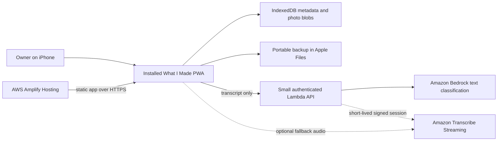

# What I Made PWA Foundation

> **Invitation-access addendum, September 8, 2026:** The original single-owner token and public Function URL boundary described below is superseded by [Invitation only private archives](../../product/invitation-only-access/design.md). The implemented branch uses Cognito managed login, account-scoped IndexedDB, API Gateway JWT and route-scope enforcement, and durable pseudonymous per-account rate windows. The original sections remain as the historical foundation decision; `ARCHITECTURE.md` describes current code.

> **Status:** Proposed for review

## 1. Executive summary

What I Made will begin as an installable web app optimized for one owner's iPhone. The app will keep cooking records and optimized photos in browser-managed local storage, create manual portable backups through Apple Files, and use a very small AWS backend only for text classification and an optional transcription fallback. This is the lowest-maintenance option that satisfies the confirmed product requirements and avoids App Store work. The main downside is that local browser data is not a backup: the owner must export it, and voice capture must be proven on the actual iPhone before it is considered dependable.

## 2. Context and scope

The owner wants to record a photo and dish name in under 20 seconds, add optional spoken details, and revisit new and repeated dishes through a dashboard, map, journal, and dish history. The product is private, single-user, connected, and does not require App Store distribution, automatic cloud sync, historical import, or offline capture.

This design settles the platform, local data boundary, photo optimization, portable backup, voice transcription, text classification, AWS footprint, and migration boundary. It does not specify every screen, the final map marker, recommendations, live cooking assistance, or nutrition features.

## 3. System context



The PWA owns the cooking archive. AWS does not hold the archive or photographs. The backend owns only secret-bearing calls to AWS services and rejects requests that do not carry the owner's credential.

## 4. Proposed design

### How it works

After cooking Oyakodon, the owner opens the home-screen app and takes or selects a photo. The app decodes the photo locally, removes metadata, and creates optimized display and thumbnail images. The owner speaks a short review through the selected Amazon Transcribe Streaming adapter. The browser requests a short-lived, narrowly scoped WebSocket URL, streams microphone audio directly to Transcribe, and retains only returned text. It does not use S3 or a batch transcription job. After **Done**, the PWA sends the combined transcript and newly finalized segment, but no audio or photograph, to the protected capture-assistance endpoint. Amazon Bedrock returns cleaned text and up to six editable dish proposals. The owner corrects them, local matching offers compatible canonical dishes and aliases, and one IndexedDB transaction saves the cooking occasion, dish attempts, metadata, and photographs.

At any time, the owner can export a schema-v2 JSON backup, invoke the iOS share sheet when file sharing is supported, and save the archive to Apple Files. A fresh or empty installation can inspect, validate, and restore that archive; the app never merges it with existing records.

### Components and responsibilities

**PWA shell.** Owns installation metadata, navigation, safe-area layout, static caching, and feature detection. It does not contain AWS secrets.

**Capture workflow.** Owns photo selection, camera capture, voice controls, draft recovery, confirmation, and manual editing. It does not decide that an AI result is true.

**Photo processor.** Owns local decode, orientation, resizing, JPEG encoding, metadata removal, thumbnails, and byte limits. It never uploads photos.

**Local repository.** Owns IndexedDB transactions, schema versions, queries, and derived history. It does not know about screens or AWS.

**Backup service.** Owns schema-v2 JSON archive creation, structural and relational validation, empty-database restore, and separately confirmed archive clearing. It does not merge two independent archives in version one.

**Voice adapter.** Owns a consistent Amazon Transcribe Streaming start, interim transcript, stop, cancel, and error interface. Typing and keyboard Dictation remain independent fallbacks.

**Parsing API.** Owns authentication, input limits, Bedrock invocation, output validation, rate limits, and redaction of logs. It never receives photographs or the cooking database.

**Classification model.** Proposes structured fields from text. It does not persist data, match canonical dishes, or bypass user confirmation.

### Decisions

#### Choose an installable web app

The confirmed requirements do not justify React Native or SwiftUI. Current iPhone web apps can open from the Home Screen as standalone apps, use substantial local storage, request persistent storage, and access the microphone through web media APIs. WebKit documents standalone Home Screen behavior in [Safari 26](https://webkit.org/blog/17333/webkit-features-in-safari-26-0/) and current storage quotas and persistence in its [storage policy](https://webkit.org/blog/14403/updates-to-storage-policy/). React Native with Expo remains a viable later migration if native background work, automatic photo-library integration, richer sharing, or App Store distribution becomes necessary. SwiftUI is rejected for version one because it adds the most iOS-specific learning and release work without a validated benefit.

The cost is that some iPhone browser behavior must be feature-detected and tested on the owner's device. A future Expo migration will reuse domain types, validation, parsing contracts, backup schemas, and most non-UI TypeScript logic, but the UI, storage adapter, and device adapters will be rewritten.

#### Keep the archive local

Metadata and photo blobs live in IndexedDB under one origin. Backup & storage shows current usage from `navigator.storage.estimate()` and offers a user-initiated **Protect storage** action when `navigator.storage.persist()` is available. Persistent mode reduces eviction risk but is not treated as a backup; WebKit explicitly notes that best-effort data can be evicted and storage writes can fail at quota. S3 photo storage is rejected for version one because it would require cloud identity, synchronization, conflict handling, deletion policies, and recovery behavior that the product does not need.

The cost is single-device access and owner-managed backup.

#### Store portable JPEGs, not originals

Each accepted source photo is decoded locally and converted to an orientation-corrected, metadata-free sRGB JPEG. The display copy has a maximum long edge of 2,048 pixels, starts at quality 0.82, and must not exceed 1.2 MB. If necessary, the encoder lowers quality to 0.72 and then reduces the long edge to 1,600 pixels. A thumbnail has a maximum long edge of 512 pixels, quality 0.74, and a target maximum of 140 KB. The original source is released after successful verification and is not stored.

JPEG is chosen over WebP or AVIF for the backup's long-term portability. Thumbnails, declared dimensions, lazy loading, and reserved aspect ratios provide the runtime performance benefits that matter on the phone. HEIC selection, wide-gamut color, orientation, and high-resolution camera inputs must be tested on the actual iPhone before release.

The cost is losing the original resolution and metadata. That is acceptable because this is an app archive, not the owner's authoritative photo library.

#### Ship a versioned JSON backup

The shipped backup is named `what-i-made-backup-YYYY-MM-DD.json` and uses format `what-i-made-backup`, schema version 2. It contains occasions, dishes, attempts, cooking photos, saved Ideas, and Idea images. Blob fields are base64 encoded with their MIME types; transient Idea drafts and the separately stored owner token are excluded.

The app offers the native share sheet when `navigator.canShare({ files })` succeeds and a standard download otherwise. Restore first parses and validates the complete file without writing. It checks the format and schema, declared counts, unique identities, every cross-store relationship, and required encoded image data. Restore is limited to an empty archive and writes all supported stores in one transaction; failure leaves the archive untouched.

This format favors the already tested, least-complex recovery path for a solo-user archive. Base64 and in-memory JSON creation carry size overhead and do not provide independent cryptographic integrity. Streaming ZIP creation, separate image files, per-file SHA-256 hashes, and segmented annual archives are deferred until measured archive size warrants them; reconsider after approximately 100 optimized photos.

#### Use AWS streaming after browser speech failed

The physical-iPhone spike selected Amazon Transcribe Streaming after raw microphone capture passed and Safari speech recognition returned no usable text. AWS supports real-time WebSocket transcription and PCM audio; its documentation recommends 50 to 200 ms chunks and 16 kHz when possible. See [streaming formats and guidance](https://docs.aws.amazon.com/transcribe/latest/dg/streaming.html) and [WebSocket setup](https://docs.aws.amazon.com/transcribe/latest/dg/streaming-setting-up.html). The PWA converts microphone input to signed 16-bit little-endian PCM in an audio worklet or an isolated compatibility adapter and sends it directly over a 15-second presigned connection URL. AWS credentials never enter the browser. Batch transcription through temporary S3 objects is rejected because it adds object lifecycle and polling latency to a short interactive flow.

What I Made and its Lambda do not durably store or log audio, but Amazon Transcribe is still a data processor. AWS documents that Transcribe stores voice inputs by default for service improvement. A Transcribe-specific AWS Organizations opt-out policy is therefore required before the real-device streaming test. The interface also discloses that AWS may retain data needed to provide and maintain the service. Keyboard Dictation and typing remain available regardless of the AWS route.

The cost is maintaining the small session signer and streaming adapter. Manual typing and keyboard Dictation remain available whenever that service is unavailable.

#### Use Bedrock only for low-risk suggestions

The parsing endpoint uses a configurable Amazon Bedrock model with deterministic strict structured output and no automatic repair request. Supported GPT models use the Mantle Responses API with `store: false`; the account-compatible GPT OSS deployment uses synchronous Bedrock InvokeModel, which does not persist response state. Server and client both validate the response. A timeout or invalid response keeps the verbatim transcript and invokes the conservative local parser. Model choice is configuration, not a persisted data dependency, so a future model replacement does not change the archive.

The model returns a country code, not cuisine, region, or arbitrary coordinates. The app converts a confirmed country code to a default point from a reviewed local geographic table. The owner can move that point later from the dish or map view. Existing-dish matching remains local and suggestive.

The cost is occasional wrong classification, which is why every result remains editable, low-confidence inferred countries require an explicit action, and confidence numbers are not presented as facts to the owner.

#### Use a deliberately small AWS footprint

Amplify Hosting serves the static PWA over HTTPS from Git. AWS documents Git-based continuous deployment for SPAs and a managed HTTPS domain in [Amplify Hosting](https://docs.aws.amazon.com/amplify/latest/userguide/welcome.html). Separate small Lambda packages own the transcription-session signer, capture assistance, and Recipe Ideas network routes so each can be deployed, limited, and disabled independently. No archive database, S3 photo bucket, API Gateway, Cognito user pool, or WAF is required for version one.

The backend uses an owner token generated during deployment and entered once on the device. Only a hash is stored in Lambda configuration. This avoids a full account system without embedding a reusable secret in public JavaScript. The downside is a manual one-time setup and token rotation if the device or credential is compromised.

### Expected monthly cost

At roughly 39 entries per month and one short parse per entry, Amplify Hosting and Lambda should remain inside their published free allowances for a solo app. Amplify currently includes 1,000 build minutes, 5 GB of CDN storage, and 15 GB of transfer per month at no charge; Lambda includes one million requests and 400,000 GB-seconds. See [Amplify pricing](https://aws.amazon.com/amplify/pricing/) and [Lambda pricing](https://aws.amazon.com/lambda/pricing/).

If AWS transcription is needed and each entry uses 20 seconds of audio, expected use is about 13 minutes per month. At the current US East streaming example rate of $0.01 per minute, that is about $0.13 per month. Amazon Transcribe is pay as you go; see [Amazon Transcribe pricing](https://aws.amazon.com/transcribe/pricing/). Nova Micro token cost for these short parsing requests should be substantially below one cent per month at current published rates. A custom domain is optional and excluded.

The deployment must set AWS budget alerts at $5 and $8 per month. Pricing can change, so the estimate is a guardrail, not a guarantee.

## 5. Invariants and requirements

### Invariants

- `INV-1`: No photograph or photo-derived pixels leave the device in version one.
- `INV-2`: A cooking occasion is not visible in history until its required photo and dish name are committed together.
- `INV-3`: Every AI-derived value remains editable and is never committed without owner confirmation.
- `INV-4`: Repeating a dish changes only that dish's derived history and marker, never country geometry or country intensity.
- `INV-5`: A failed network, transcription, or model request cannot delete a capture draft.
- `INV-6`: A backup restore writes no records unless the archive format, schema, counts, required fields, identities, relationships, and encoded image data validate.
- `INV-7`: AWS credentials and the owner token's plaintext deployment value are absent from the shipped source bundle.
- `INV-8`: Stored identifiers remain stable when names, countries, ratings, or map locations change.
- `INV-9`: Deleting a cooking occasion does not silently delete a canonical dish that still has another attempt.
- `INV-10`: Parsing spend is bounded by request-size, rate, and concurrency limits; transcription spend is client-limited during normal use and monitored with budget alerts and a kill switch, not represented as a hard cap.
- `INV-11`: A dish's default map photo is either `null` or an eligible photo from that dish's own cooking history.
- `INV-12`: Every cooking occasion has at least one dish attempt and one referenced main photograph; the referenced main photograph cannot be deleted directly.
- `INV-13`: Adding a dish and its optional photograph is one transaction, and removing a dish never removes the occasion's main photograph.

### Requirements

- The PWA opens from an iPhone Home Screen icon in standalone mode over HTTPS.
- Camera and photo-library entry points are both available.
- Capture supports a main photo, dish name, optional whole-number rating from 1 to 10, notes, informal ingredients, and optional dish photos.
- The app saves local drafts before calling an external service.
- Storage quota failure produces a clear recovery path to export or remove data.
- Backup and restore remain available without an AWS account login inside the app.
- Voice input always has a visible typed alternative.
- The parsing API accepts text only and rejects oversized or malformed input.
- The app records no third-party product analytics.
- The map can switch between Cook Density and Culinary Peaks without changing stored dish or attempt data.
- The owner can replace a dish's default map photo with any eligible photo from that dish's history.
- A saved occasion exposes every photograph and supports adding more from Camera or Library, assignment to a dish or the whole occasion, main-photo promotion, and deletion of non-main photographs.
- The main photograph cannot be deleted until another photograph is promoted, and an occasion cannot lose its final dish.

## 6. Interfaces and data

### Local records

```text
CookingOccasion
  id: UUID
  cookedAt: ISO timestamp
  createdAt: ISO timestamp
  updatedAt: ISO timestamp
  mainPhotoId: UUID

Dish
  id: UUID
  canonicalName: string
  aliases: string[]
  countryCode: ISO 3166-1 alpha-3 | null
  mapLocation: { x: 0..100, y: 0..100, countryKey: ISO alpha-3, mapDataVersion: integer } | null
  defaultMapPhotoId: UUID | null
  createdAt: ISO timestamp
  updatedAt: ISO timestamp

DishAttempt
  id: UUID
  occasionId: UUID
  dishId: UUID
  position: nonnegative integer
  rating: integer 1..10 | null
  notes: string | null
  ingredientsText: string | null
  createdAt: ISO timestamp
  updatedAt: ISO timestamp

Photo
  id: UUID
  occasionId: UUID
  dishAttemptId: UUID | null
  role: main | extra
  mimeType: image/jpeg
  width: integer
  height: integer
  byteLength: integer
  sha256: lowercase hexadecimal
  displayBlob: Blob
  thumbnailBlob: Blob
  createdAt: ISO timestamp

Setting
  key: string
  value: versioned JSON
```

First-attempt status, attempt count, recent-new status, rating progression, and map marker strength are derived from these records and are not independently stored.

### Naming and identity

All record IDs are generated with `crypto.randomUUID()` before a draft is written. IDs never derive from dish names or dates. Canonical dish names are owner-confirmed display values and may change without changing identity. Merging dishes moves attempts to the retained dish ID, records the removed name as an alias when useful, and deletes the unreferenced dish only after the transaction succeeds.

`Dish.defaultMapPhotoId` is an owner-editable reference, not a copied image. An eligible default photo belongs to an occasion containing an attempt for that dish or directly references one of that dish's attempts. The first eligible photo becomes the initial default. Changing the default does not modify an occasion, attempt, or photo. Deleting the referenced photo transactionally selects the most recent remaining eligible photo, or sets the field to `null` when none remains.

`Dish.mapLocation` is an additive, owner-editable projected point tied to the bundled geography version and resolved country key. The shared geometry module parses the bundled country paths, validates points with even-odd polygon membership, and derives a guaranteed interior fallback when no current custom point is usable. Changing the resolved country clears the prior custom point atomically. Schema-v2 backup restore resets only well-formed points from another geography version; malformed or current-version out-of-country points fail validation.

IndexedDB schema version 5 makes the `attempts.occasionId` index non-unique so one occasion can contain several dish attempts. Existing records are not rewritten. `DishAttempt.position` gives new multi-dish occasions stable display order; migrated attempts without it fall back to existing creation and identity order. The occasion owns the date and main-photo reference. Each photograph may reference one attempt or remain occasion-wide with a null `dishAttemptId`.

`saveOccasion()` commits one or more dish attempts and all initial photographs atomically. `addDishToOccasion()` can atomically add a later dish and optional assigned photograph. `addPhotosToOccasion()`, `updatePhoto()`, `deletePhoto()`, and `removeDishAttempt()` preserve the final-dish and main-photo invariants. Flat dish-attempt projections continue to feed Year, Map, and canonical dish history; nested occasion projections feed Journal and occasion detail.

### Parsing request

```json
POST /v1/parse-cook
Authorization: Bearer <Cognito-access-token>
Content-Type: application/json

{
  "transcript": "Existing text plus: Uh, I made Oyakodon...",
  "voiceSegment": "Uh, I made Oyakodon...",
  "locale": "en-US"
}
```

The transcript is limited to 5,000 Unicode characters and the new voice segment to 2,000. The strict response returns `cleanedVoiceText`, zero to six ordered dishes, and bounded warnings. Each dish proposes `dishName`, `rating`, `notes`, `ingredientsText`, ISO alpha-3 `countryCode`, `countrySource` (`explicit`, `inferred`, or `unknown`), and confidence per field. Unknown values are `null`, not invented placeholders. Explicit countries fill after catalog validation; inferred countries fill only at confidence 0.90 or above, with weaker valid values offered as an explicit action.

Conversational cleanup removes vocal fillers, non-semantic discourse fillers, immediate repetitions, and abandoned false starts while preserving names, meaningful uses of “like,” quantities, negation, comparisons, uncertainty, and cooking details. The client rewrites only the newly finalized voice segment, never pre-existing typed text. Service failure retains the verbatim segment and invokes the conservative local parser.

Existing-dish matching runs only on-device over canonical names and aliases. A unique exact normalized name or alias may be preselected when its resolved country does not conflict. Fuzzy candidates use documented token, bigram, and containment thresholds and remain unselected. Confirming a candidate sends its stable UUID only to the local `saveOccasion()` transaction, which learns the proposed spelling as an alias; archive names are never included in the parsing request.

Country entry is an accessible local combobox over canonical Natural Earth names and aliases. Blank is valid; a non-empty value must resolve to one selected country before save. Ambiguous “Korea” intentionally returns both South Korea and North Korea as choices and never becomes a stored map key by itself.

A versioned bundled international-dish catalog supplies canonical spellings, transliteration variants, and optional reviewed ISO alpha-3 associations across all 13 culinary regions. The local resolver ranks this catalog together with saved dish aliases, filters known country conflicts, and applies a correction only when one candidate clears the strict threshold and margin. The raw phrase remains visible through an undoable **Suggested from your note** notice. Confirmed saves may add that phrase to the selected dish's local aliases; the private archive is never used to build the shared cloud vocabulary.

### Backup envelope

```json
{
  "format": "what-i-made-backup",
  "schemaVersion": 2,
  "createdAt": "2026-08-29T00:00:00.000Z",
  "counts": {
    "occasions": 0,
    "dishes": 0,
    "attempts": 0,
    "photos": 0,
    "ideas": 0,
    "ideaImages": 0
  },
  "records": {
    "occasions": [],
    "dishes": [],
    "attempts": [],
    "photos": [],
    "ideas": [],
    "ideaImages": []
  }
}
```

Importers reject unknown formats and unsupported schema versions before writing.

## 7. Failure behavior and lifecycle

Photo processing begins only after the source is decoded. If decode, orientation, or encoding fails, the source is not stored and the owner sees a retry or choose-another-photo action. If a quota error occurs during the transaction, the entire transaction aborts and the draft remains available for export or retry.

The capture draft is saved before voice or parsing begins. A microphone denial switches to typing. A recognition timeout stops after 45 seconds and retains final text already received. Parsing has a ten-second client timeout and no automatic retry. Failure returns verbatim text to the editable capture screen, applies basic local suggestions, and offers one user-initiated Retry. Recording again, cancelling, navigation, and `pagehide` abort the active request; request generations prevent late results from changing a newer draft.

Backup creation reads the local archive and prepares one JSON `File`; an interrupted or canceled export leaves IndexedDB unchanged. The interface says “Backup prepared” because the PWA cannot verify whether the owner completed Save to Files. Restore reads and validates before opening a write transaction. Version-one restore refuses to overwrite a non-empty archive and explains how to export and use the separately confirmed erase flow first. Erasure clears archive records and drafts atomically while preserving the owner token.

The service worker updates only after the current capture finishes. Schema migrations run before the main UI opens, preserve the prior database until success, and show a recoverable error with backup restore when they fail.

## 8. Security, privacy, and operations

The trust boundary is the owner's installed PWA. Photos and the archive remain local. Safari keyboard Dictation may transmit microphone audio to Apple under Apple's speech permissions; the application neither receives nor stores that audio. After the owner taps **Done**, the finalized transcript text is sent to the parsing API; typed text is sent when Review is selected. No audio, photograph, archive record, or local match candidate is included, and no cooking record is committed until the owner confirms the proposal. If AWS streaming transcription is enabled, microphone audio goes directly to Amazon Transcribe over TLS and is not durably persisted by What I Made or Lambda. Amazon Transcribe's documented service-improvement storage is disabled through an AWS Organizations opt-out policy before real cooking notes are sent; AWS may still retain data needed to provide and maintain the service under its terms. Bedrock model invocation logging and response storage remain disabled. AWS states that Bedrock isolates and encrypts content and does not use it to train base models in its [generative AI security guidance](https://docs.aws.amazon.com/prescriptive-guidance/latest/security-reference-architecture-generative-ai/gen-ai-sra.html).

The shipped app uses a strict Content Security Policy, pinned dependencies, no third-party runtime scripts, no analytics, and no secrets in client code. The owner token is entered after installation, stored locally, sent only to the configured API origin, compared in constant time against a server-side hash, and can be rotated. CORS allows only the production and explicit local-development origins, but CORS is not treated as authentication.

The parsing endpoint accepts only POST requests, caps request bodies at 8 KB, caps transcript length at 5,000 characters, rejects unknown JSON keys, applies a ten-request-per-minute warm-instance guard for the single owner token, and is deployed with Lambda reserved concurrency of two. The separate transcription-session signer has reserved concurrency one and issues a single-purpose URL that expires after 15 seconds without returning AWS credentials. Client cleanup limits normal streams to 45 seconds, but the direct socket path is budget-monitored rather than server-capped. Cloud logs contain request IDs, latency, status, and available aggregate token counts, not transcripts or model outputs.

Operations use structured status logs, a $5 warning budget, an $8 urgent budget, and a documented kill switch that disables AI while leaving manual capture functional.

## 9. Acceptance criteria

- `AC-1`: On the owner's iPhone, the production URL can be added to the Home Screen and opens as a standalone app.
- `AC-2`: A camera photo and dish name can be confirmed and saved in under 20 seconds in a representative real-device test.
- `AC-3`: Camera and photo-library sources each produce an orientation-correct display JPEG no larger than 2,048 pixels on its long edge and 1.2 MB.
- `AC-4`: Inspecting all production network requests during capture shows no photo bytes or photo-derived payloads leaving the device.
- `AC-5`: Killing connectivity during classification retains the complete local draft and permits manual save.
- `AC-6`: Browser voice recognition passes ten representative cooking-note trials on the owner's iPhone with acceptable latency and correction effort, or the AWS streaming adapter is selected before voice is marked complete.
- `AC-7`: An exported schema-v2 JSON backup restores all occasions, dishes, attempts, ratings, notes, ingredients, map locations, Ideas, and optimized images into an empty installation with matching counts and valid relationships.
- `AC-8`: A corrupt or unsupported backup writes zero records and reports the failing validation.
- `AC-9`: A representative one-year archive exports through Files and restores on the owner’s iPhone; archive size is measured again after approximately 100 optimized photos to decide whether streaming ZIP work is required.
- `AC-10`: AI output with missing, invalid, or extra fields is rejected and shown as an editable raw transcript rather than stored.
- `AC-11`: Merging two dish records preserves every attempt and photo and leaves one stable canonical dish ID.
- `AC-12`: The deployed AWS configuration has the parsing request caps, endpoint-specific concurrency caps, log redaction, transcription kill switch, and $5/$8 budget alerts described in this design.
- `AC-13`: Saving another mapped attempt updates only the selected-year aggregate for its confirmed country; both Cook Density and Culinary Peaks derive from that same total without modifying archive records.
- `AC-14`: Changing a dish's default map photo updates its geographic drill-down without modifying any occasion, attempt, rating, note, photo record, country fill, or peak.
- `AC-15`: Deleting a selected default photo chooses the most recent remaining eligible photo transactionally, or clears the reference when none remains.
- `AC-15a`: Saving a default photo and in-country approximate point commits both preferences atomically; cancelling or submitting an invalid point writes neither.
- `AC-16`: Saving two dishes creates one Journal occasion and one dashboard cook while preserving two independently editable dish attempts and two dish-history contributions.
- `AC-17`: Every saved photograph appears in the calendar-year recap; a non-main photo can be reassigned, promoted, or deleted, while the active main photo remains protected.

## 10. Test approach

Unit tests prove photo resizing thresholds, schema validation, UUID identity, derived new/repeat status, local matching, merge semantics, map-view derivation, and default-photo eligibility for `INV-2`, `INV-3`, `INV-4`, `INV-8`, `INV-9`, `INV-11`, `AC-3`, `AC-10`, `AC-11`, `AC-13`, `AC-14`, and `AC-15`.

IndexedDB integration tests force transaction failures and quota errors to prove `INV-2`, `INV-5`, and `AC-5`. Backup fixture tests cover valid, corrupt, truncated, unknown-version, non-empty, restored, and erased archives for `INV-6`, `AC-7`, `AC-8`, and `AC-9`.

API contract tests send missing tokens, wrong tokens, oversized bodies, malformed JSON, model timeouts, and invalid model responses to prove `INV-7`, `INV-10`, `AC-10`, and `AC-12`.

Browser tests cover the capture and restore flows at 375px and in landscape, with enlarged text and reduced motion. Real-iPhone tests prove installation, camera, photo-library selection, permission denial, voice behavior, share-to-Files, restore-from-Files, and the under-20-second target for `AC-1` through `AC-7`.

A network inspection test blocks and records outbound requests while a photo is processed and saved to prove `INV-1` and `AC-4`.

## 11. Risks and tradeoffs

- **Local data eviction or accidental deletion.** Request persistent storage, expose storage usage, make backup easy, and never describe local persistence as a backup.
- **Voice API variance across iPhone versions.** Feature-detect, test the actual device, retain typing, and keep AWS streaming behind one adapter.
- **Large JSON backups stress mobile memory or sharing.** Measure the first 100 optimized photos and a representative one-year export on the real iPhone; add streaming ZIP export, hashes, or segmented annual archives only when observed size requires them.
- **AI misclassifies country.** Return confidence, use a controlled country table, require confirmation, and make later edits simple.
- **A public personal API is abused.** Require an owner token, cap inputs and rates, limit concurrency, redact logs, set budgets, and keep a kill switch.
- **Optimized photos lose original quality.** Keep originals in Apple Photos when desired and state clearly that What I Made stores display copies.
- **PWA-to-Expo migration still requires work.** Keep domain logic, schemas, and external-service contracts platform-neutral; accept that UI and device adapters will be rewritten.

## 12. Open questions

- The owner's actual iPhone model and iOS/Safari version must be recorded before the voice spike. This does not block general implementation, but it blocks declaring browser speech complete.
- Cook Density and Culinary Peaks are implemented as a remembered world/region segmented control. A visible scale, exact ranked summary, and photographic region/country shelves handle crowded geography; physical-iPhone VoiceOver, color legibility, and safe-area validation remains.
- The final product name and app icon are undecided. They do not block task breakdown.
- Multi-year segmented backup should be reconsidered after measuring the first 100 optimized photos. It does not block version one.

## 13. Out of scope

- Automatic S3 photo backup or cross-device synchronization
- User accounts, household sharing, and social features
- Historical Apple Photos import
- Meal planning, grocery lists, and live step-by-step cooking assistance
- Nutrition and macro tracking
- Photo understanding by an AI service
- App Store distribution
- Sentiment analysis
- Merge restore between two non-empty archives
- Full visual screen designs beyond the accepted map-view behavior
- Cuisine and regional taxonomies
